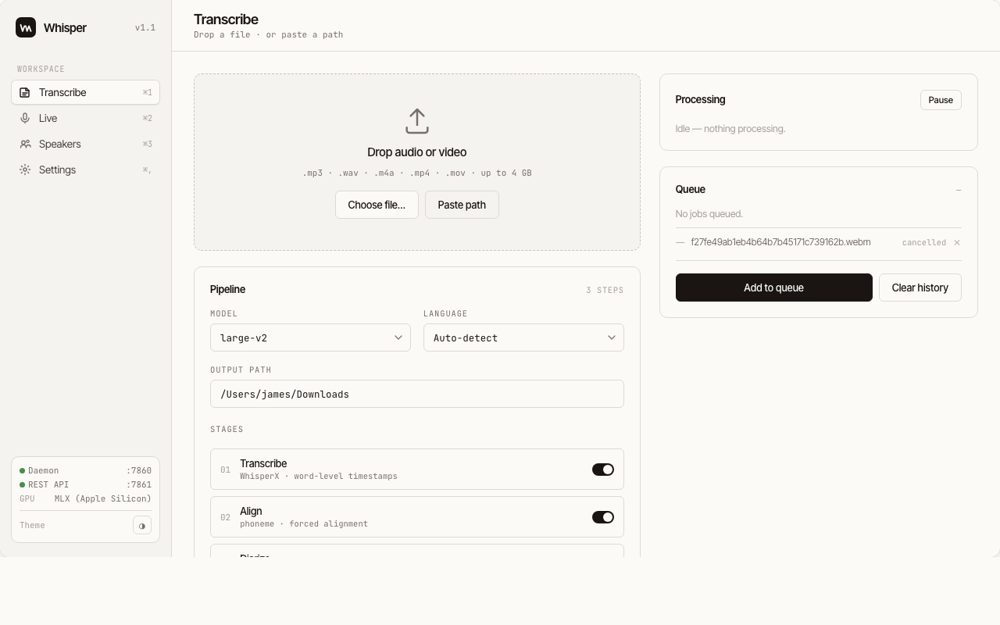
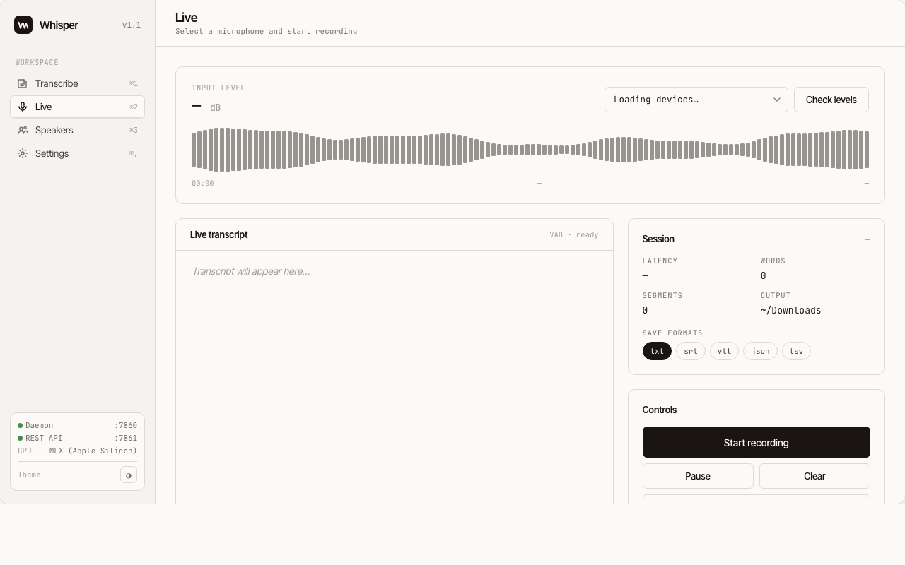
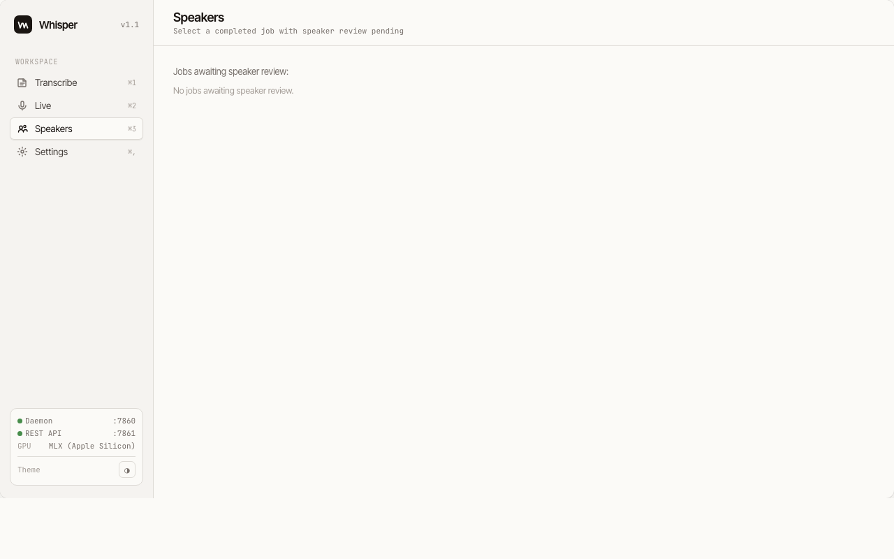
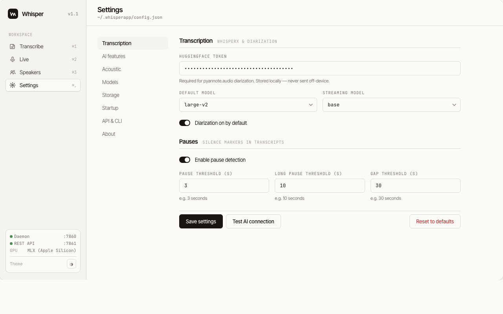

# WhisperApp

**Local, private transcription for people who deal with a lot of audio.** Drop a folder of recordings, a day's worth of meetings, or hours of interview audio — WhisperApp queues them, processes them in the background, and gives you clean transcripts with speaker names, timestamps, and optional AI annotations. Nothing leaves your machine.

Built on [WhisperX](https://github.com/m-bain/whisperX). Runs as a background app on macOS and Windows with a web UI, full REST API, CLI, and system tray icon. Mix and match — use the UI for review, the CLI for automation, the API for integrations.

---

## What it's good for

- **Batch transcription** — queue dozens of files, walk away. SQLite-backed job queue with checkpoint recovery so crashes don't lose progress.
- **Meeting capture** — live microphone recording with real-time transcript, speaker detection, and automatic output to your format of choice.
- **Research and interviews** — speaker diarization identifies who said what; label speakers by name before saving. Output goes to TXT, SRT, VTT, JSON, or TSV.
- **AI-augmented review** — connect Claude, OpenAI, or local Ollama to get automatic speaker identification, meeting notes, and emotion analysis alongside the raw transcript.
- **Automation** — full REST API and CLI mean you can trigger transcription from scripts, integrate with other tools, or wire it into an MCP workflow.

---

## Screenshots

### Transcribe — drop files, configure the pipeline, manage the queue


### Live — real-time mic streaming with waveform, VAD, and session stats


### Speakers — awaiting review after a diarized job completes


### Settings — full configuration including pause detection thresholds


---

## Features

### Batch transcription & queue
- **10+ Whisper model sizes** — `tiny` through `large-v3` and `turbo`; Apple Silicon auto-uses MLX for fast on-device inference
- **Queue with priority control** — reorder jobs, delete items, pause and resume the worker to reclaim CPU
- **Checkpoint recovery** — each job saves progress through stages; a crash picks back up where it left off
- **Formats** — TXT, SRT, VTT, JSON, TSV — all generated simultaneously from the same aligned data

### Speaker diarization
- **pyannote.audio** — identifies each speaker's turns throughout the recording
- **Review UI** — listen to representative snippets per speaker, type the name, save
- **Diarized output** — every format gets `[Speaker Name]:` prefixes, timestamps align to the word

### Live transcription
- **Real-time streaming** with sub-second latency (faster-whisper + Silero VAD)
- **Any microphone** — pick from detected devices, check input levels before you start
- **Auto-pauses batch queue** when recording starts, resumes it when you stop — no CPU contention
- **Polish** — after stopping, run full WhisperX alignment + diarization on the recorded session

### Transcript annotations
Injected inline so every output format gets the same enriched content:

**Pause detection** — three configurable silence tiers:

| Marker | Default | Example output |
|--------|---------|----------------|
| `[Pause, N seconds]` | ≥ 3 s | `[Pause, 4 seconds]` |
| `[Long Pause, N seconds]` | ≥ 10 s | `[Long Pause, 15 seconds]` |
| `[Gap, N minutes]` | ≥ 30 s | `[Gap, 2 minutes 10 seconds]` |

**Acoustic analysis** (optional, librosa-based):

| Marker | What it means |
|--------|--------------|
| `[Loud]` / `[Quiet]` | Volume relative to speaker baseline |
| `[Raised voice]` / `[Animated]` | Elevated pitch variance |
| `[Rapid]` / `[Slow]` | Speaking rate outside normal range |

**Emotion detection** (optional, HuggingFace SER models):

| Model | Type |
|-------|------|
| SpeechBrain IEMOCAP | 4-class: Happy / Sad / Angry / Neutral |
| WavLM multi-class | 9-class emotion |
| wav2vec2-8emotion | 8-class, RAVDESS fine-tuned |
| audeering dimensional | Continuous arousal + valence |

Run multiple models: unanimous → label kept, split → highest confidence wins.

### AI integration
Connect an LLM to unlock AI-assisted review (no AI required for core transcription):

| Feature | What it does |
|---------|-------------|
| Identify speakers | Reads the transcript, suggests names + role from conversational cues |
| Meeting notes | Structured summary with action items |
| Emotion synthesis | Narrative annotation combining SER model outputs |

Providers: **Claude** (Anthropic), **OpenAI**, **Ollama** (local, no API key needed).

### REST API & CLI
Everything in the UI is also available via API (port 7861) and CLI — useful for scripting batch imports, polling job status, or integrating with other tools. Interactive API docs at `http://127.0.0.1:7861/docs` when running.

---

## Quick start

### macOS

```zsh
git clone --recurse-submodules https://github.com/jlldavies/whisperapp.git
cd whisperapp

brew install portaudio
python3 -m venv .venv
.venv/bin/pip install -e ".[dev]"
.venv/bin/python -m whisperapp
```

Apple Silicon (M1/M2/M3/M4): `mlx-whisper` installs automatically — no CUDA needed, fast Metal inference.

### Windows

```powershell
git clone --recurse-submodules https://github.com/jlldavies/whisperapp.git
cd whisperapp

python -m venv .venv
.venv\Scripts\activate
pip install -e ".[dev]"
python -m whisperapp
```

NVIDIA GPU auto-detected and used (float16). SSL certificates route through the Windows cert store — works through corporate proxies and AV tools without manual configuration.

### First run

1. App starts in the system tray and opens **http://127.0.0.1:7860**
2. Go to **Settings → Transcription** and enter your [HuggingFace token](https://huggingface.co/settings/tokens) — required for speaker diarization (free account)
3. Drop a file on the **Transcribe** screen or hit **Live** to start recording

---

## CLI

```bash
# Submit files
whisperapp transcribe interview.mp3
whisperapp transcribe meeting.mp4 -m large-v2 --diarize --formats srt,txt,vtt

# Manage the queue
whisperapp list
whisperapp status <job-id>
whisperapp cancel <job-id>
whisperapp delete <job-id>
whisperapp move-up <job-id>
whisperapp move-down <job-id>

# Control the worker
whisperapp pause          # free up CPU
whisperapp resume
whisperapp worker-status

# Read transcripts
whisperapp transcript <job-id>
whisperapp transcript <job-id> --format srt

# AI features (requires provider configured)
whisperapp identify-speakers <job-id>
whisperapp meeting-notes <job-id>

# Model management
whisperapp models
whisperapp download <model-id>
whisperapp delete-model <model-id>

# System
whisperapp info
whisperapp ai-status
```

---

## REST API reference

All endpoints are local-only (`127.0.0.1:7861`). Swagger UI at `/docs`.

```
GET    /jobs                      List all jobs
POST   /jobs                      Submit a transcription job
GET    /jobs/{id}                 Status + result
DELETE /jobs/{id}                 Delete permanently
POST   /jobs/{id}/cancel          Cancel
POST   /jobs/{id}/move-up         Reorder in queue
POST   /jobs/{id}/move-down       Reorder in queue
GET    /jobs/{id}/transcript      Get transcript (?format=txt|srt|vtt)

GET    /worker/status             Running or paused
POST   /worker/pause              Pause batch processing
POST   /worker/resume             Resume batch processing

POST   /stream/start              Start live session → {session_id}
POST   /stream/chunk              Send audio chunk (base64 PCM float32)
POST   /stream/stop               Stop + save → {text, segments}
POST   /stream/polish             Full alignment + diarize on session audio

GET    /speakers/{id}             Speaker snippets for review
POST   /speakers/{id}/label       Save name mappings → triggers output write
POST   /speakers/{id}/identify    AI-suggest speaker names
POST   /speakers/{id}/notes       Generate meeting notes

GET    /models/catalogue          Full model catalogue with download status
GET    /models/disk-summary       Disk usage by category
POST   /models/{id}/download      Start background download
DELETE /models/{id}               Delete model files
POST   /models/{id}/activate      Set as active for category
POST   /models/check-updates      Check all for newer versions

GET    /config                    Read config
POST   /config                    Update config fields
GET    /info                      Platform, acceleration backend, versions
POST   /storage/reveal            Open ~/.whisperapp in Finder/Explorer
```

---

## Configuration

All settings live at `~/.whisperapp/config.json` — editable via the Settings UI, `POST /config`, or by editing the file directly.

| Key | Default | Description |
|-----|---------|-------------|
| `hf_token` | `""` | HuggingFace access token (for diarization) |
| `default_model` | `"large-v2"` | Whisper model for new jobs |
| `default_output_path` | `~/Downloads` | Where transcripts are saved |
| `diarize_by_default` | `true` | Enable diarization for new jobs |
| `streaming_model` | `"base"` | Whisper model for Live mode |
| `ai_provider` | `"none"` | `none` / `claude` / `openai` / `ollama` |
| `ai_api_key` | `""` | API key for AI provider |
| `ai_model` | `""` | Model ID (blank = provider default) |
| `ai_base_url` | `""` | Ollama or OpenAI-compatible endpoint |
| `pause_detection` | `true` | Insert silence markers in output |
| `pause_threshold` | `3` | Seconds before `[Pause]` |
| `long_pause_threshold` | `10` | Seconds before `[Long Pause]` |
| `gap_threshold` | `30` | Seconds before `[Gap]` |
| `acoustic_enabled` | `false` | Enable acoustic feature markers |
| `acoustic_volume_threshold` | `1.8` | RMS ratio vs rolling baseline |
| `acoustic_pitch_threshold` | `40.0` | F0 std dev threshold (Hz) |
| `acoustic_rate_fast_wpm` | `180` | WPM threshold for `[Rapid]` |
| `acoustic_rate_slow_wpm` | `90` | WPM threshold for `[Slow]` |
| `emotion_enabled` | `false` | Enable SER emotion detection |
| `emotion_model_ids` | `[]` | Which SER model IDs to run |
| `emotion_confidence_threshold` | `0.65` | Min confidence to include label |
| `emotion_combine_with_ai` | `false` | AI synthesis of model outputs |

---

## Hardware acceleration

| Platform | Backend | How |
|----------|---------|-----|
| Apple Silicon (M1–M4) | mlx-whisper | Auto-installed, Metal GPU |
| NVIDIA CUDA | WhisperX float16 | Auto-detected |
| CPU (any platform) | WhisperX int8 | Fallback, always works |

`GET /info` reports the active backend.

---

## Development

```bash
# Run the test suite (no GPU or HF token required)
python -m pytest tests/ -q
# Expected: 138 passed, 2 skipped

# Integration tests (downloads models, needs HF_TOKEN env var)
HF_TOKEN=hf_... pytest tests/test_integration.py -v -m integration
```

Tests cover: config, queue, worker, streaming, formatters, pause markers, acoustic analysis, emotion registry, model catalogue, speakers, server endpoints, and AI provider abstraction.

---

## Ports

| Service | URL |
|---------|-----|
| Web UI | http://127.0.0.1:7860 |
| REST API | http://127.0.0.1:7861 |
| Swagger docs | http://127.0.0.1:7861/docs |

## Keyboard shortcuts

| Action | macOS | Windows |
|--------|-------|---------|
| Transcribe | ⌘1 | Ctrl+1 |
| Live | ⌘2 | Ctrl+2 |
| Speakers | ⌘3 | Ctrl+3 |
| Settings | ⌘, | Ctrl+, |

---

## Requirements

- Python 3.10+
- [HuggingFace account](https://huggingface.co) (free — for speaker diarization models)
- macOS: `brew install portaudio`
- Windows/Linux: nothing extra for CPU; CUDA toolkit for GPU

---

## License

MIT
